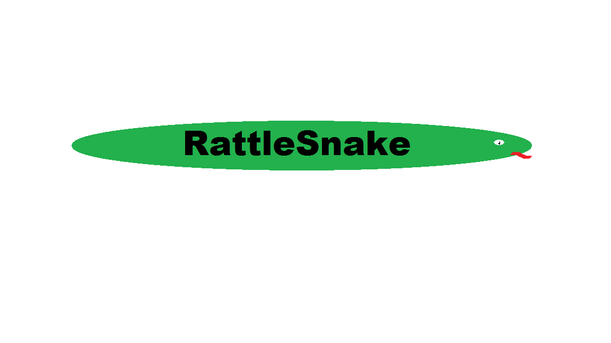

# Rattle Snake

[](https://gitter.im/dahquan/rattlesnake?utm_source=badge&utm_medium=badge&utm_campaign=pr-badge&utm_content=badge) [[Documentation](http://dahquan.github.io/rattlesnake/)]
[[Examples](http://dahquan.github.io/rattlesnake/examples.html)]

An Open Source Slither.io Client

***Needs more contributers! Better documentation coming soon!***

## Running Feeder Bot

This seems to be the most popular question. For instructions on running the feeder bot or other included examples go [HERE](http://dahquan.github.io/rattlesnake/examples.html)

## Overview

The main reason behind this bot is for educational purposes. With great power comes great responsibility, don't ruin the game for others!

Unlike many other slither.io bots, this one does not require a browser and can be ran on your desktop/server with [Node.JS](http://nodejs.org) installed

***I don't plan on adding adding advanced functionality such as AI. The bot logic relies on what you would like to do with it. This should just be used as a library.***

## NPM

```sh
$ npm install --save rattlesnake
```

## Features

- [x] Connect to slither.io servers
- [x] Connect via HTTP proxy
- [x] Face position (head towards a location)
- [x] Snake position
- [x] Retrieve Leaderboard data
- [x] Events (eat food, dead, spawned, etc...)
- [ ] Determine snake length
- [ ] Plugin system
- [ ] Track food
- [ ] Track snake angles
- [ ] Sectors
- [ ] Proxy auth, HTTPS, SOCKS
- [ ] ???

## Code Example

```
'use strict'

// ========
// Leaderboard Example
//
// This example will get the top players on the leaderboard then disconnect
//

const Bot = require('rattlesnake')

const bot = new Bot({
  name: process.env.SLITHER_SERVER_NAME || 'RattleSnake',
  // logLevel: 'debug',
  server: process.env.SLITHER_SERVER || '199.21.79.246:444'
})

// Just listen for the leaderboard event then disconnect
bot.once('leaderboard', function(leaderboard) {
  console.log()
  console.log('====== TOP ' + leaderboard.length + ' ======')
  console.log()

  leaderboard.forEach(function(entry, i) {
    console.log('#' + i + '. ' + entry.name)
  })

  bot.close()
})

// Print any errors
bot.on('error', function(error) {
  console.log('Error: ' + error)
})

// Connect the bot
bot.connect()
```

## Contributing

Please take a look at [CONTRIBUTING](docs/CONTRIBUTING.md)

## Special Thanks To:

- [iiegor/slither](https://github.com/iiegor/slither)
- [ClitherProject/Slither.io-Protocol](https://github.com/ClitherProject/Slither.io-Protocol)
- [Google](http://www.google.com)

## License

MIT © [Dahquan Hinds](https://github.com/dahquan)
